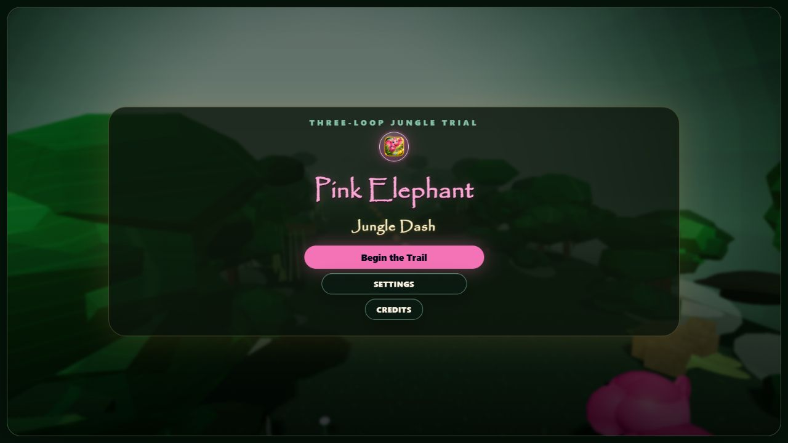
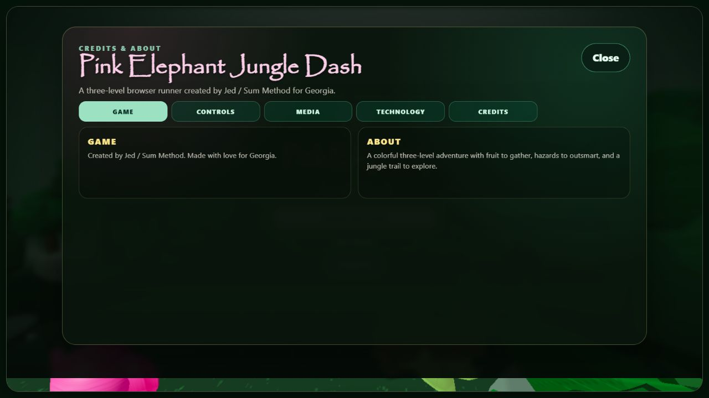

# Pink Elephant Jungle Dash

A playful three-level 3D jungle runner made by Jed / Sum Method for Georgia. Guide a pink elephant along handcrafted trails, gather fruit, and learn each run's hazards as the jungle changes around you.

[Play the game](https://sum-method.github.io/pink-elephant-jungle-dash/)



## The project

This is a personal browser-game project built around a small, complete adventure: a title screen and opening scene lead into three playable levels, with a reward scene between the first two and a finale at the end. It is designed for desktop, touch screens, and gamepads, and can be installed as a PWA.



Highlights:

- A real-time 3D runner built with React and Three.js.
- Three handcrafted levels with fruit, hazards, rewards, and saved progress.
- Keyboard, touch, and gamepad input with pause and accessibility options.
- Skippable story videos, synthesized browser audio, offline fallback, and installable PWA support.
- The Snake Gate has a separate visual model and gameplay collider, so visual changes do not redefine collision behavior.

## Controls

- Move and steer: WASD or arrow keys. Hold Up/W to build charge.
- Jump: Space. Holding Space slides; a charged run can smash with **F** or spin with **E**.
- Pause: Esc or P. Mute: M.
- Touch: use the left joystick and the right-side action buttons.
- Gamepad: left stick or D-pad to move, A to jump, B/X/L/R for actions, and Start/Menu to pause.

## Built with

React 19, Three.js, Vite, and the browser Web Audio API. Gameplay systems, level definitions, save data, input, and UI are kept in focused modules under `src/game` and `src/components`.

The music and sound effects in the playable build are synthesized in the browser with Web Audio; no standalone soundtrack files are included. The opening, reward, and finale videos were made with Google Gemini. The Snake Gate GLB came from Microsoft Copilot image-to-3D experiments using ChatGPT-generated image references.

## Run and validate locally

Use Node.js 20.19+ or 22.12+.

```sh
npm ci
npm run dev
```

Then open the local address printed by Vite. Before a release, run:

```sh
npm run lint
npm test
npm run build
npm run build:pages
```

## Credits and reuse

Created by **Jed / Sum Method for Georgia**. Source code is available under the MIT License. Non-code media is excluded from that grant; see [MEDIA_LICENSE.md](MEDIA_LICENSE.md) for asset credits and reuse terms.

## Latest release — v1.1.0

This portfolio baseline improves first-run guidance and early-level pacing, moves the Credits button to the center of the title actions, clears foliage from the running lane, replaces stale prototype documentation, and adds repeatable game self-tests plus a CI quality workflow.
